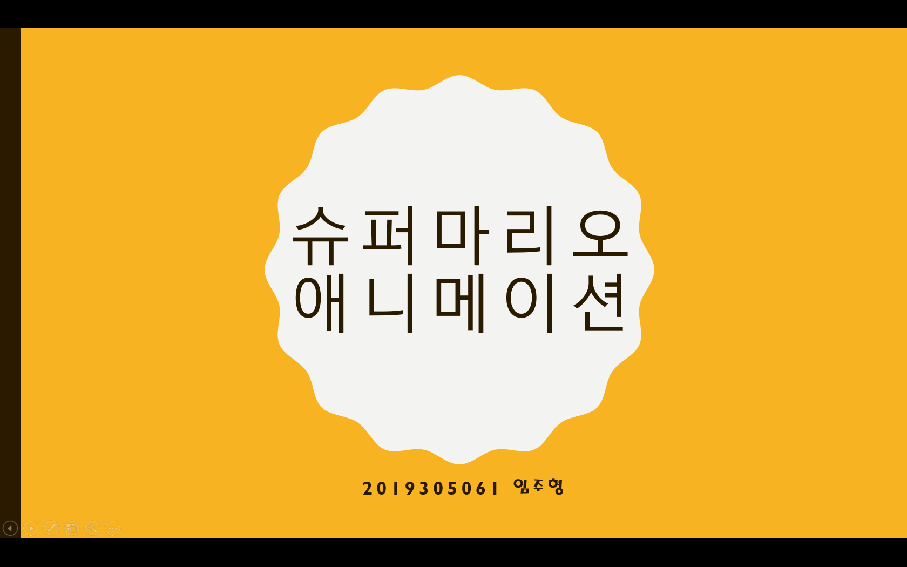
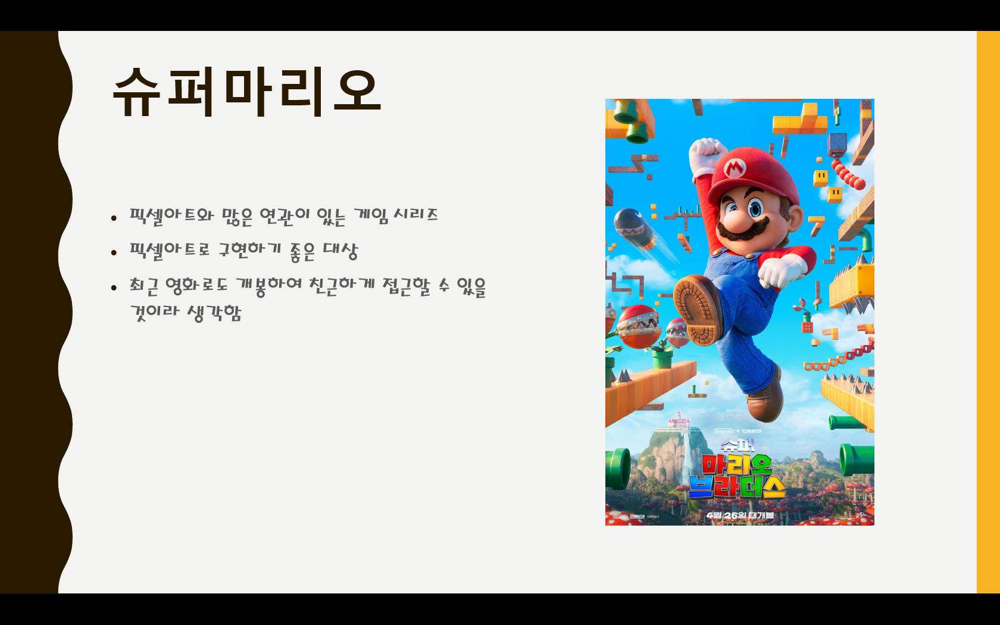
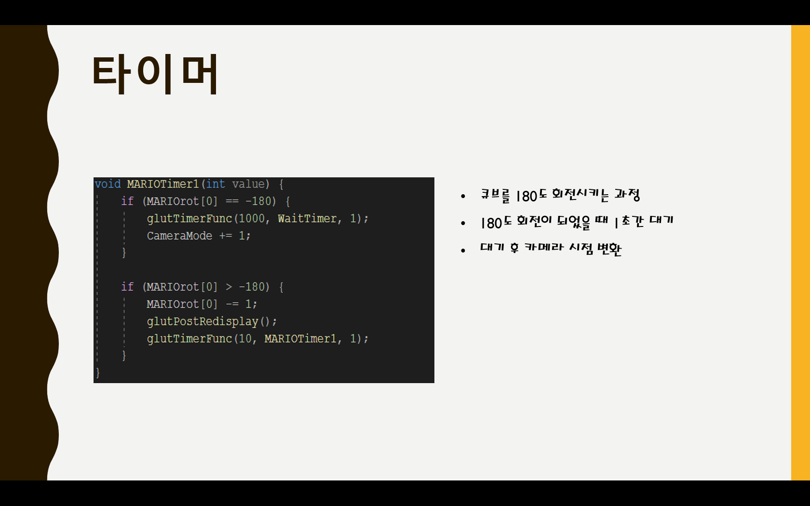
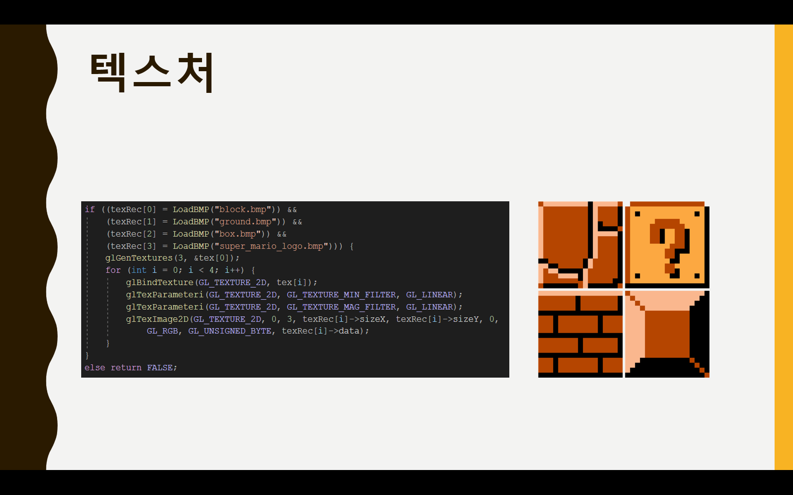
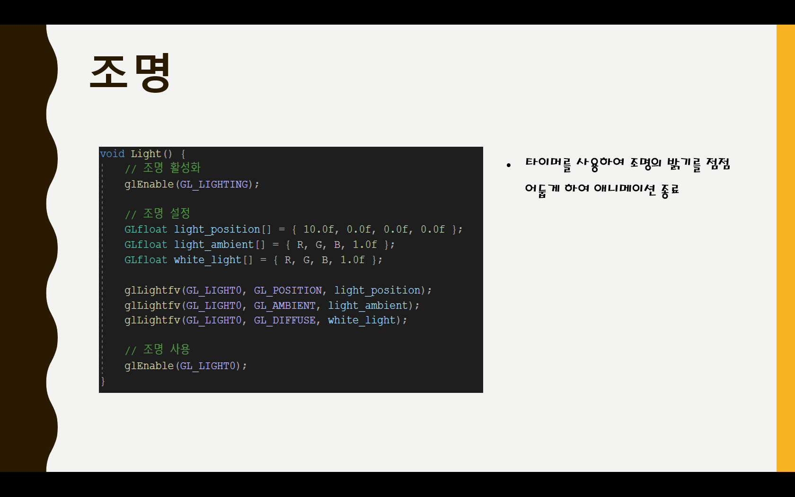
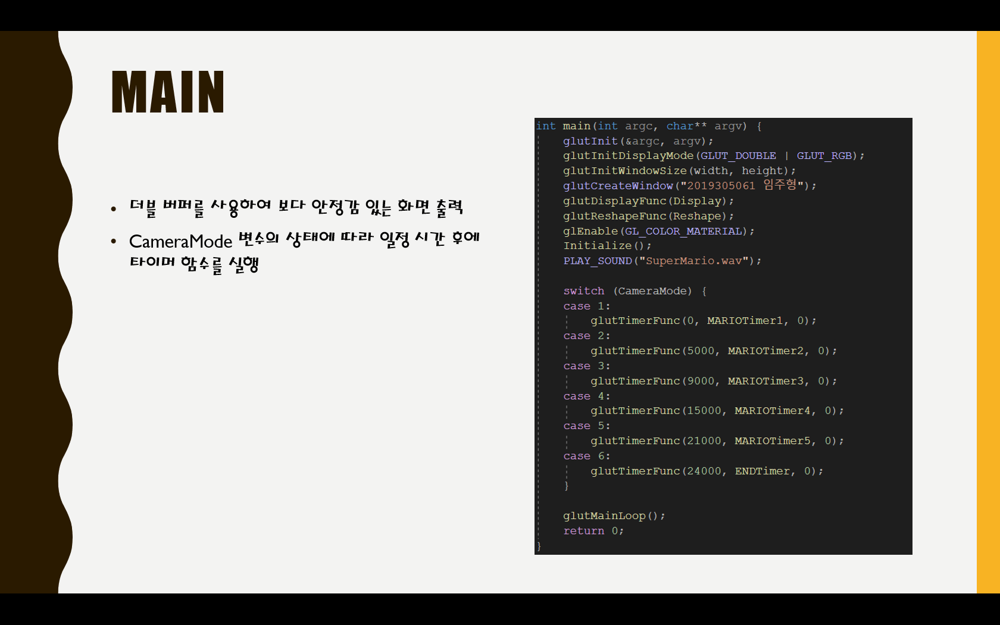

### 🧱 슈퍼마리오 픽셀아트 애니메이션
- **장르**: 픽셀아트 기반 3D 애니메이션 (학습용 프로젝트)
- **개발 기간**: 2023.04 ~ 2023.06
- **사용 기술**: OpenGL, C++
- **주요 기능**:
  - 큐브 모델을 활용한 픽셀아트 애니메이션 구현
  - `glRotatef()` 및 타이머 함수를 활용한 회전 애니메이션
  - 초기 슈퍼마리오 텍스처 적용
  - 조명 효과로 마무리 연출
  - `glOrtho()`를 이용한 2D 느낌의 화면 구성
- **기여 내용**:
  - 큐브 조합과 Orthographic 시점을 적용하여 색다른 연출 시도
  - 타이머 및 카메라 상태값 기반의 씬 흐름 제어
- **성과**:
  - 컴퓨터 그래픽스 수업 프로젝트로 제출
  - OpenGL 저수준 렌더링 구조에 대한 이해도 향상  
- **[Code](https://github.com/LimJuHyung1/ComputerGraphics/blob/main/PixelArt/pixelart.cpp)**

- - -
  

